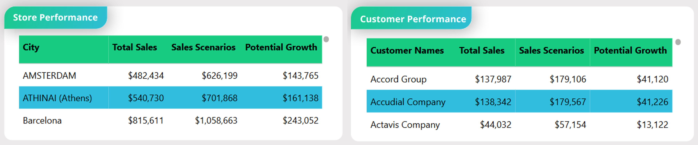

# Momentum Corp. Strategic Sales Scenario Simulator: A Power BI Case Study

<p align="center">
  <a href="https://tinyurl.com/2d85d68u" target="_blank">
    
  </a>
</p>

This repository contains a high-level strategic planning tool built in Power BI for "Momentum Corp.," a fictional distribution company. The dashboard functions as a macro-economic simulator, allowing senior leadership to model the revenue impact of market-wide pricing adjustments and demand shifts. It is designed to support the annual operating plan (AOP) by providing a data-driven way to set realistic sales targets.


## Table of Contents
- [1. Case Study Overview](#1-case-study-overview)
  - [The Business Problem: The Uncertainty of Annual Planning](#the-business-problem-the-uncertainty-of-annual-planning)
  - [The Solution: An Interactive Strategic Simulator](#the-solution-an-interactive-strategic-simulator)
  - [Tech Stack](#tech-stack)
- [2. The Analytical Approach: A Dashboard Deep Dive](#2-the-analytical-approach-a-dashboard-deep-dive)
  - [1. The Control Panel: Defining the Macro Scenario](#1-the-control-panel-defining-the-macro-scenario)
  - [2. Top-Line KPIs: The Immediate Financial Outcome](#2-top-line-kpis-the-immediate-financial-outcome)
  - [3. Trend Analysis: The Scenario's Impact Over Time](#3-trend-analysis-the-scenarios-impact-over-time)
  - [4. Breakdown Analysis: Identifying Key Winners](#4-breakdown-analysis-identifying-key-winners)
- [3. Repository Structure](#3-repository-structure)
- [4. How to Explore This Project](#4-how-to-explore-this-project)

---

## 1. Case Study Overview

### The Business Problem: The Uncertainty of Annual Planning
For large companies like Momentum Corp., the annual operating planning (AOP) process is fraught with challenges. Leadership needs to set ambitious yet achievable revenue targets for the year ahead, but these decisions often rely on complex spreadsheet models and a high degree of guesswork. Key strategic questions were difficult to answer with confidence:
*   What is a realistic sales target for next year based on our current trajectory?
*   If we implement a 5% price increase across the board, what will the net impact on revenue be?
*   How would a potential market downturn, causing a 3% drop in demand, affect our ability to hit our targets?

### The Solution: An Interactive Strategic Simulator
This Power BI tool was developed to replace static spreadsheets with a dynamic, interactive simulator. It allows the executive team to model top-down scenarios in real-time, instantly visualizing the potential outcomes of their strategic decisions. The dashboard provides a clear, data-driven foundation for setting the company's annual sales goals.

### Tech Stack
*   **Analysis & Visualization:** Power BI Desktop & Power BI Service
*   **Modeling & Calculations:** DAX (What-If Parameters & Scenario Logic)
*   **Data Transformation (ETL):** Power Query

---

## 2. The Analytical Approach: A Dashboard Deep Dive

The dashboard guides a strategic planner through a logical workflow, from building a macro-economic scenario to understanding its impact on specific customers and stores.

### 1. The Control Panel: Defining the Macro Scenario
The journey begins on the left-hand panel, where a user defines the high-level assumptions for the simulation.


*   **Scope Definition:** The user selects the `time frame` and `region` to set the boundaries for the analysis.
*   **The Core Levers:** Two powerful sliders allow for market-wide adjustments:
    1.  **Pricing Change:** Simulates a universal price increase (or decrease) across all products.
    2.  **Demand Change:** Models an anticipated shift in overall market demand.

### 2. Top-Line KPIs: The Immediate Financial Outcome
The KPI cards at the top provide the instant "so what?" of the simulation.


*   **`Sales Metrics (vs last year)`:** This is the baseline health check, showing the selected period's `Total Sales` and its growth or decline compared to the previous year.
*   **`Scenario Metrics (vs actual)`:** This is the result card. It displays the new `Sales Scenarios` value and its percentage uplift. This is the primary answer to the "what-if" question.

### 3. Trend Analysis: The Scenario's Impact Over Time
The charts in the center of the dashboard illustrate the performance of the scenario over the selected period.


*(Note: For this composite image, include the 'Performance vs Scenario', 'Monthly Performance vs Scenario', and 'Monthly Potential Sales Growth' charts.)*

*   **`Performance vs Scenario`:** This cumulative area chart visualizes the compounding effect of the strategy, showing the gap between the scenario sales (blue) and baseline sales (green) widening over time.
*   **`Monthly Performance vs Scenario`:** This bar chart provides a month-by-month breakdown, allowing leaders to see if the scenario's impact is consistent or seasonal by comparing the two bars directly.
*   **`Monthly Potential Sales Growth`:** This chart **isolates the net financial gain** from the scenario for each month. By visualizing only the difference (`[Sales Scenarios] - [Total Sales]`), it makes it incredibly easy to quantify the exact dollar impact per period and spot which months benefit most from the proposed strategy.

### 4. Breakdown Analysis: Identifying Key Winners
The tables at the bottom right translate high-level strategy into real-world impact by answering, **"Who and where will be most affected by this strategy?"**



*   **`Store Performance` & `Customer Performance`:** These tables rank the stores (cities) and customers by their `Potential Growth` under the scenario. This allows sales leaders to identify which key accounts and regions they should coordinate with to execute the plan.

This multi-faceted approach transforms the dashboard from a report into a true strategic simulator.

**For a complete breakdown of the DAX formulas powering this simulator, please see the detailed documentation in the `docs/` folder.**

---

## 3. Repository Structure
```
.
├── assets/
│   └── (All dashboard screenshots and demo GIF)
├── docs/
│   ├── 01_Business_Context.md
│   ├── 02_Analytical_Approach.md
│   └── 03_DAX_Implementation.md
├── .gitignore
└── README.md
```

---

## 4. How to Explore This Project
1.  **Interact with the Live Simulator:**
    *   Click the "Live Simulator" badge at the top of this page or go directly to: [https://tinyurl.com/2d85d68u](https://tinyurl.com/2d85d68u)
2.  **Review the Documentation:**
    *   For a deeper understanding of the business logic and technical implementation, review the detailed markdown files in the `docs/` folder.
```


