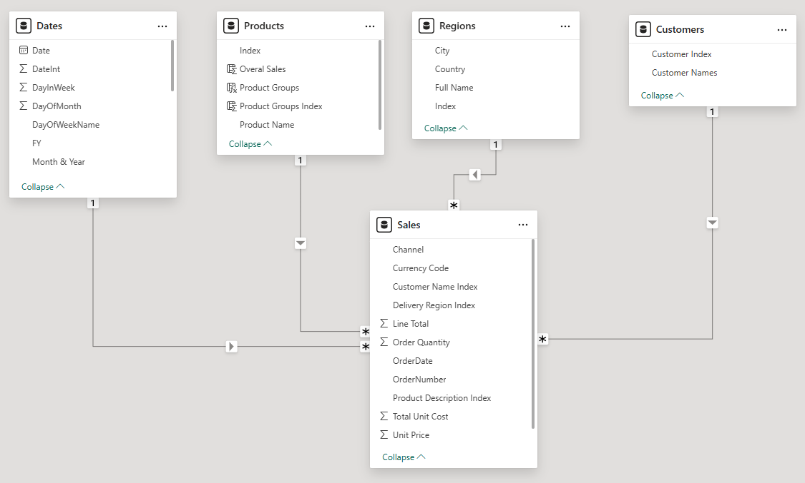

# 3. DAX Implementation: The Simulation Engine

This document details the complete technical foundation of the Strategic Sales Scenario Simulator, including the data model structure and an exhaustive dictionary of all DAX calculations that power the tool.

## Data Model

The project is built on a standard Star Schema, centered around a `Sales` fact table. This design is optimized for the performance and flexibility required for this type of scenario analysis.



### Table Descriptions

| Table       | Type      | Description                                                                                             |
|-------------|-----------|---------------------------------------------------------------------------------------------------------|
| **Sales**   | Fact      | Contains the granular transactional data. Each row represents a unique order line item.                 |
| **Dates**   | Dimension | A standard calendar table providing time-based attributes for all time-intelligence calculations.       |
| **Products**| Dimension | Contains a unique list of all products, including their names and product group information.             |
| **Regions** | Dimension | Contains geographic data about where sales occurred, such as city and country.                          |
| **Customers** | Dimension | A unique list of all customers who made purchases.                                                      |

---

## The Complete DAX Dictionary

The following sections detail all DAX logic, structured by function, from the user inputs to the final calculated outputs.

### Part 1: User Input Parameters

These measures create and capture the values from the interactive sliders.

**`Pricing Scenarios` & `Demand Scenario` (Calculated Tables)**
*   **Purpose:** These `GENERATESERIES` functions create the underlying single-column tables of numbers that feed the slicers.
*   **DAX Code:**
    ```dax
    Pricing Scenarios = GENERATESERIES(0, 0.2, 0.01)
    Demand Scenario = GENERATESERIES(-0.05, 0.1, 0.01)
    ```

**`Pricing Scenarios Value` & `Demand Scenario Value` (Measures)**
*   **Purpose:** These measures use `SELECTEDVALUE` to capture the single number the user has selected on each slider, making it available for use in other calculations.
*   **DAX Code:**
    ```dax
    Pricing Scenarios Value = SELECTEDVALUE('Pricing Scenarios'[Pricing Scenarios], 0.05)
    Demand Scenario Value = SELECTEDVALUE('Demand Scenario'[Demand Scenario], 0.05)
    ```

### Part 2: Core & Time-Intelligence Measures

These are the foundational measures for calculating sales and comparing them over time.

**`Total Sales`**
*   **Purpose:** Calculates the total revenue based on the quantity sold and the price of each product. This is the primary "baseline" metric.
*   **DAX Code:**
    ```dax
    Total Sales =
    SUMX(
        Sales,
        Sales[Order Quantity] * Sales[Unit Price]
    )
    ```

**`Sales LY`**
*   **Purpose:** A standard time-intelligence measure that calculates the `Total Sales` for the same period in the prior year. (Note: The formula was not provided, but would typically be `CALCULATE([Total Sales], SAMEPERIODLASTYEAR(Dates[Date]))` or similar).

**`% Change to LY`**
*   **Purpose:** Calculates the percentage difference between the current period's sales and the sales from the prior year.
*   **DAX Code:**
    ```dax
    % Change to LY =
    VAR sales_diff = [Total Sales] - [Sales LY]
    VAR pct_sales_diff =
        DIVIDE(
            sales_diff,
            [Sales LY]
        )
    RETURN
        pct_sales_diff
    ```

### Part 3: The Scenario Engine

This is the core logic that computes the outcome of the user-defined scenario.

**`Sales Scenarios`**
*   **Purpose:** The heart of the simulator. This measure iterates through every row of the `Sales` table and recalculates its value by applying the `Pricing Change` to the `Unit Price` and the `Demand Change` to the `Order Quantity`.
*   **DAX Code:**
    ```dax
    Sales Scenarios =
    SUMX(
        Sales,
        (Sales[Order Quantity] * (1 + [Demand Scenario Value])) * (Sales[Unit Price] * (1 + [Pricing Scenarios Value]))
    )
    ```

**`Potential Sales Growth`**
*   **Purpose:** Calculates the absolute dollar difference between the `Sales Scenarios` and the baseline `Total Sales`. This isolates the net gain or loss from the simulation.
*   **DAX Code:**
    ```dax
    Potential Sales Growth = [Sales Scenarios] - [Total Sales]
    ```

**`% Actual to Scenario Sales`**
*   **Purpose:** Calculates the percentage uplift of the scenario sales compared to the baseline cumulative sales.
*   **DAX Code:**
    ```dax
    % Actual to Scenario Sales =
    VAR act_scen_diff = [Cumulative Sales Scenarios] - [Cumulative Sales]
    VAR pct_diff =
        DIVIDE(
            act_scen_diff,
            [Cumulative Sales],
            0
        )
    RETURN
        pct_diff
    ```

### Part 4: Cumulative Measures for Trend Analysis

These measures calculate the running totals used in the area and bar charts.

**`Cumulative Sales` & `Cumulative Sales Scenarios`**
*   **Purpose:** Calculates the running total of sales for both the baseline and the scenario, from the beginning of the selected time period to the current date.
*   **DAX Code:**
    ```dax
    Cumulative Sales =
    CALCULATE(
        [Total Sales],
        FILTER(
            ALLSELECTED(Dates[Date]),
            Dates[Date] <= MAX(Dates[Date])
        )
    )

    Cumulative Sales Scenarios =
    CALCULATE(
        [Sales Scenarios],
        FILTER(
            ALLSELECTED(Dates[Date]),
            Dates[Date] <= MAX(Dates[Date])
        )
    )
    ```